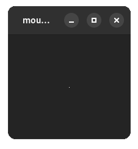
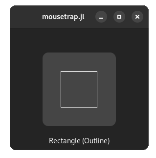
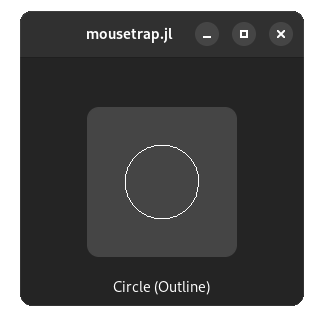
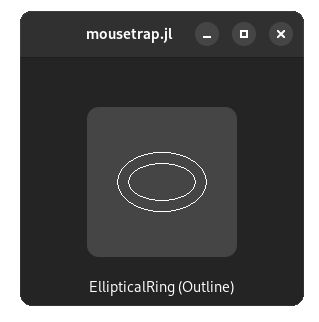
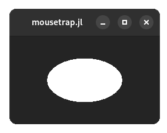
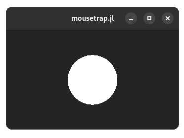

# Chapter 9: Native Rendering

In this chapter we will learn:
+ How to use `RenderArea`
+ How to draw any shape
+ How to efficiently show an image as a texture
+ How to influence blending
+ How to apply a 3D transform to a shape
+ How to compile a GLSL Shader and set its uniforms

---

!!! danger "Native Rendering on MacOS"
    All classes and functions in this chapter **are impossible to use on MacOS**. For this platform,
    mousetrap was compiled in a way where any function relating to OpenGL was made unavailable. This 
    is because of Apples decision to deprecate OpenGL in a way where only physical owners of a Mac
    can compile libraries that have it as a dependency. See [here](https://github.com/users/Clemapfel/projects/2?pane=issue&itemId=33978341) for more information.

    If we try to use a disabled object on MacOS, a **fatal error** will be thrown at runtime.

---


!!! details "Running snippets from this Chapter"
    To run any partial code snippet from this section, we can use the following `main.jl` file:
    ```julia
    using mousetrap
    main() do app::Application
        window = Window(app)

        render_area = RenderArea()

        # snippet code here

        aspect_frame = AspectFrame(1)
        set_child!(aspect_frame, render_area)
        set_size_request!(aspect_frame, Vector2f(200, 200))
        set_child!(window, aspect_frame)
        present!(window)
    end
    ```

In the [chapter on widgets](04_widgets.md), we learned that we can create new widgets by combining already pre-defined widgets as a *compound widget*. We can create a new widget that has a `Scale`, but we can't render our own scale with, for example, a square knob. In this chapter, this will change.

By using the native rendering facilities mousetrap provides, we are free to create any shape we want, assembling displays and new widgets pixel-by-pixel, line-by-line.

## RenderArea

The central widget of this chapter is [`RenderArea`](@ref), which is a canvas used to display native graphics. At first, it may seem very simple:

```julia
render_area = RenderAre()
```

This will render as a transparent area, because `RenderArea` has no graphic properties of its own. Instead, we need to create separate **shapes**, then **bind them for rendering**, after which `RenderArea` will display the shapes for us.

## Shapes

In general, shapes are defined by a number of **vertices**. A vertex has a position in 2D space, a color, and a texture coordinate. In this chapter, we will learn how to user each of these, starting with the position.

### Vertex Coordinate System

A shape's vertices define where inside the `RenderArea` it will be rendered. The coordinate system for these is different from the one we used for widgets. OpenGL, and thus mousetraps `Shape`, use the **right hand coordinate system**, which is familiar from traditional math:


(source: [learnopengl.com]())

Where for now, we assume the z-coordinate for any vertex is set to 0, reducing the coordinate system to a 2D plane. 

We will refer to this coordinate system as **gl coordinates**, while the widget coordinate system used for `ClickEventController` and the like as **widget space coordinates**.

To further illustrate the difference between gl and widget space coordinates, consider this table, where `w` is the widgets width, `h` is the widgets height, in pixels:
 
| Conceptual Position | GL Coordinate | Widget Space Coordinate |
|---------------------|---------------|-------------------------|
| top left            | `(-1, +1)`    | `(0, 0)` |
| top                 | `( 0, +1)`    | `(w / 2, 0)`|
| top right           | `(+1, +1)`    | `(w, 0)`|
| left                | `(-1,  0)`    | `(0, y / 2)`|
| center              | `( 0,  0)`    | `(w / 2, y / 2)`|
| right               | `(+1,  0)`    | `(w, y / 2)`|
| bottom left         | `(-1, -1)`    | `(0, y)`|
| bottom              | `( 0, -1)`    | `(w / 2, y)`|
| bottom right        | `(+1, -1)`    | `(w, y)`|

We see that the OpenGL coordiante system is **normalized**, meaning the values of each coordinate are inside `[-1, 1]`, while the widget-space coordinate system is **absolute**, meaning the values of each coordinate take the allocate size of the widget into account, being inside `[0, w]` and `[0, h]` for the x- and y- coordinate, respectively.

At any point, we can convert between the coordinate system using [`from_gl_coordinates`](@ref) and [`to_gl_coordinates`](@ref), which convert gl-to-widget-space and widget-space-to-gl coordinates, respectively. Of course, the widget space coordinates depend on the current size of the `RenderArea`. When it is resized, the old coordinates may be out of date, which is why using the *normalized* gl system is preferred. 

### Rendering Shapes

We'll now create our first shape, which is a point. A point is always exactly one pixel in size.

```julia
shape = Shape()
as_point!(shape, Vector2f(0, 0))
```

Where we use `Vector2f(0, 0)` as the points position, meaning it will appear at the origin of the render area, its center.

The above is directly equivalent to the following:

```julia
shape = Point(Vector2f(0, 0))
typeof(shape)
```
```
mousetrap.Shape
```

Note that here, `shape` is still of type `Shape`. [`Point`](@ref) is simply a convenience function for initializing a shape, then calling [`as_point!`](@ref).

We can bind this shape for rendering. To do this, we create a [`RenderTask`](@ref) with the shape, then use [`add_render_task!`](@ref) to add the task to the schedule tasks of our `RenderArea`. From this point onwards, anytime the `RenderArea` goes through a render cycle, it will draw all its task, including our point:

```julia
shape = Point(Vector2f(0, 0))
add_render_task!(render_area, RenderTask(shape))
```



!!! details "How to generate this Image"
    ```julia
    using mousetrap
    main() do app::Application

        window = Window(app)
        set_title!(window, "mousetrap.jl")
        render_area = RenderArea()

        shape = Point(Vector2f(0, 0))
        add_render_task!(render_area, RenderTask(shape))

        frame = AspectFrame(1.0, render_area)
        set_size_request!(frame, Vector2f(150, 150))
        set_margin!(frame, 10)
        set_child!(window, frame)
        present!(window)
    end
    ```

If we want to remove a task from our render area, we need to call [`clear_render_tasks!`](@ref), then add all other render tasks again.

### Shape Types

Mousetrap offers a wide variety of pre-defined shape types. This makes it so we don't have to manually set each vertices position. 

#### Point

A [`Point`](@ref) is always exactly one pixel in size. Its constructor takes a single `Vector2f`:

```julia
point = Point(Vector2f(0, 0))
```


#### Points

[`Points`](@ref) is number of points. Instead of taking a single `Vector2f`, its constructor takes `Vector{Vector2f}`:

```julia
points = Points([
    Vector2f(-0.5, 0.5), 
    Vector2f(0.5, 0.5), 
    Vector2f(0.0, -0.5)
])
```


#### Line 

A [`Line`](@ref) is defined by two points, between which a 1-pixel thick line will be drawn:

```julia
line = Line(
    Vector2f(-0.5, +0.5), 
    Vector2f(+0.5, -0.5)
)
```


#### Lines

[`Lines`](@ref) takes a vector of point pairs. For each of these, a 1-pixel thick line will be drawn:

```julia
lines = Lines([
    Vector2f(-0.5, 0.5) => Vector2f(0.5, -0.5),
    Vector2f(-0.5, -0.5) => Vector2f(0.5, 0.5)
])
```


#### LineStrip

`LineStrip` should not be confused with `Lines`. `LineStrip` is a *connected* series of lines. It takes `Vector{Vector2f}`. A line will be drawn between each successive pair of coordinates, meaning the last vertex of the previous line will be used as the first vertex of the current line.

In general, if the supplied vector of points is `{a1, a2, a3, ..., a(n)}` then `LineStrip` will render as a series of lines with coordinate pairs `{a1, a2}, {a2, a3}, ..., {a(n-1), a(n)}`

```julia
line_strip = LineStrip([
    Vector2f(-0.5, +0.5),
    Vector2f(+0.5, +0.5),
    Vector2f(+0.5, -0.5),
    Vector2f(-0.5, -0.5)
])
```


#### Wireframe

`Wireframe` is similar to a `LineStrip`, except that it also connects the last and first vertex. So for a supplied vector `{a1, a2, a3, ..., an}`, the series of lines will be `{a1, a2}, {a2, a3}, ..., {a(n-1), a(n)}, {a(n), a1}`, the last vertex-coordinate pair is what distinguishes it from a `LineStrip`. As such, `Wireframe` is sometimes also called a **line loop**.

```julia
wireframe = Wireframe([
    Vector2f(-0.5, +0.5),
    Vector2f(+0.5, +0.5),
    Vector2f(+0.5, -0.5),
    Vector2f(-0.5, -0.5)
])
```


Note how this shape takes the exact same coordinates as `LineStrip`, but draws one more line, connecting the last to the first vertex.

#### Triangle

A `Triangle` is constructed using three `Vector2f`, one for each of its vertices:

```julia
triangle = Triangle(
    Vector2f(-0.5, 0.5),
    Vector2f(+0.5, 0.5),
    Vector2f(0.0, -0.5)
)
```


#### Rectangle

A `Rectangle` has four vertices, but it is defined by its top-left point and size. As such, it is always axis-aligned, though we can call [`rotate!`](@ref) after initialization to change this.

```julia
rectangle = Rectangle(
    Vector2f(-0.5, 0.5),
    Vector2f(1, 1)
)
```


#### Circle

A `Circle` is constructed from a center point and radius. We also need to specify the number of outer vertices used for the circle. This number will determine how "smooth" the outline is. For example, a circle with 3 outer vertices is a equilaterla triangle, a circle with 4 outer vertices is a square, a circle with 5 is a pentagon, etc. 

As the number of outer vertices increase, the shape approaches a mathematical circle, but will also require more processing power. Furthermore, a 3-vertex circle is an equilateral triangle, while a 4-vertex circle is a square, a 5-vertex circle a pentagon, etc.

```julia
shape = Circle(
    Vector2f(0, 0), # center
    0.5,            # radius
    32              # n outer vertices
)
```


#### Ellipse

A `Ellipse` is a more generalized from of a `Circle`. It's x- and y-radius determine the shape of the ellipse

```julia
ellipse = Ellipse(
    Vector2f(0, 0), # center
    0.6,            # x-radius
    0.4,            # y-radius
    32              # n outer vertices
)
```


#### Polygon

The most general form of convex shapes, `Polygon` is constructed using a vector of vertices, which will be sorted clockwise, then their [outer hull](https://en.wikipedia.org/wiki/Convex_hull) will be calculated, which results in the final convex polygon:

```julia
polygon = Polygon([
    Vector2f(0.0, 0.75),
    Vector2f(0.75, 0.25),
    Vector2f(0.5, -0.75),
    Vector2f(-0.5, -0.5),
    Vector2f(-0.75, 0.0)
])
```


#### Rectangular Frame

A `RectangularFrame` takes the top-left vertex, the outer size, and the x- and y-width, which will be the thickness of the frame horizontally and vertically:

```julia
rectangular_frame = RectangularFrame(
    Vector2f(-0.5, 0.5),  # top-left
    Vector2f(1, 1),       # width, height
    0.15,                 # x-thickness
    0.15,                 # y-thickness
)
```


#### Circular Ring

The round form of a rectangular frame, we have `CircularRing`, which takes a center, the radius of the outer perimeter, as well as the thickness. Like `Circle` and `Ellipse`, we have to specify the number of outer vertices, which decides the smoothness of the ring:

```julia
circular_ring = CircularRing(
    Vector2f(0, 0),  # center
    0.5,             # radius of outer circle
    0.15,            # thickness
    32               # n outer vertices
)
```


#### Elliptical Ring

A generalization of `CircularRing`, `EllipticalRing` has an ellipse as its outer shape. Its thickness along the horizontal and vertical dimension are supplied separately, making it far more flexible than `CircularRing`.

```julia
elliptcal_ring = EllipticalRing(
    Vector2f(0, 0),  # center
    0.6,             # x-radius
    0.4,             # y-radius
    0.15,            # x-thickness
    0.15,            # y-thickness
    32               # n outer vertices
)
```


#### Outline

Lastly, we have a special shape. [`Outline`](@ref) does not take any vertex positions for its constructor. Instead, we construct an `Outline` shape from another shape. It will then generate a wireframe for the outer perimeters of the original shape.

As the name suggest, this is useful for generating outlines of another shape. By rendering the `Outline` on top of the original shape, we can achieve a similar effect to how `Frame` is used for widgets.

```julia
outline = Outline(triangle)
```


```julia
outline = Outline(rectangle)
```


```julia
outline = Outline(circle)
```


```julia
outline = Outline(ellipse)
```


```julia
outline = Outline(polygon)
```


```julia
outline = Outline(rectangular_frame)
```


```julia
outline = Outline(circular_ring)
```


```julia
outline = Outline(elliptical_ring)
```


Rendering these white outline on top of a white shape would make them invisible, of course. To achieve the desired effect, we need to make the outline another color, which brings us to the additional properties of all `Shape`s.

### Shape Properties

#### Vertex Properties

Shapes are made up of vertices whose properties we have discussed before. 

We can set the property of a single vertex of a shape using [`set_vertex_color!`](@ref), [`set_vertex_position!`](@ref), and [`set_vertex_texture_coordinate!`](@ref).

Each of these take an index, which is the index of the vertex in clockwise order. To know how many vertices a shape actually has, we use [`get_n_vertices`](@ref).

We rarely will modify individual vertices, as working on the `Shape` as a whole is much more convenient.

##### Centroid

The **centroid** of a shape is the intuitive "center of mass". In mathematical terms, it is the component-wise mean of all vertex coordinates. In practice, for many rotationally symmetrical shapes such as rectangles, triangle, circle, and ellipses, the centroid will be the "center" of the shape, as it is defined in common language. 

We can access the centroid using [`get_centroid`](@ref). To move a shape a certain distance, we move its centroid by that distance by calling [`set_centroid`](@ref), which will automatically move all other vertices of the shape such that its new component wise mean is identical to the coordinate we specified.

#### Rotation

We can rotate all of a `Shape`s vertices around a point in gl coordinates by calling [`rotate`](@ref), which takes an `Angle` as its first argument:

```julia
# rotate shape around its center
rotate!(shape, degrees(90), get_centroid(shape))
```

#### Color

To change the color of a shape as a whole, we use [`set_color!`](@ref). This simply calls `set_vertex_color!` on all of a shapes vertices. By default, a shapes color will be `RBGA(1, 1, 1, 1)`, white.

#### Visibility

We can prevent a shape from being rendered by calling `set_is_visible!(false)`. This is different from making all vertices of a shape have an opacity of `0`. `is_visible` directly hooks into the shapes render function and prevents it from being called, as opposed to it completing rendering and not being visible on screen. Settings a shapes visibility to `false` is useful when [culling](https://en.wikipedia.org/wiki/Hidden-surface_determination) shapes to improve performance.

#### Bounding Box

We can access the [axis aligned bounding box](https://en.wikipedia.org/wiki/Bounding_volume) of a shape with [`get_bounding_box`](@ref), which returns an [`AxisAlignedRectangle`](@ref). Using this, we can query the top-left coordinate and size of the bounding box.

---

Lastly, each shape has an optional **texture**, which is what the texture coordinate properties of each vertex are used for. If a shape does not have a texture, it will be rendered as a solid color.

## Textures

In the chapter on widgets, we learned that we can use the `ImageDisplay` widget to display static images. This works, but has a number of disadvantages:

+ image data is not updated every frame that it is rendered
+ uploading data is costly, downloading data is impossible
+ scaling the image will always trigger linear interpolation
+ the image is always shown in full, as a rectangle

If we need the additional flexibility, we should instead use a `Shape` along with a [`Texture`](@ref), which represents an image living on the graphics card.

We create a texture from an `Image` like so:

```julia
image = Image()
load_from_file!(image, "path/to/image.png")

texture = Texture()
create_from_image!(texture, image)
```

Once `create_from_image` is called, the image data is uploaded to the graphics cards' RAM, so we can safely discard the `Image` instance, unless we want to update the texture later on.

To display the texture on screen, we need to bind it to a shape, then render that shape:

```julia
texture_shape::Shape = Rectangle(Vector2f(-1, 1), Vector2f(2, 2))
set_texture!(texture_shape, texture)

add_render_tasK!(render_area, RenderTask(texture_shape))
```

How and where the texture is displayed depends on the shapes vertices **texture coordinate**. These coordinates are in `([0, 1], [0, 1])`, which will be called **texture space**. 

| Conceptual Position | Texture Coordinate |
|---------------------|---------------|
| top left            | `(0, 0)`    |
| top                 | `(0.5, 0)`    |
| top right           | `(1, 0)`    |
| left                | `(0, 0.5)`    |
| center              | `(0.5, 0.5)`    |
| right               | `(1, 0.5)`    |
| bottom left         | `(0, 1)`    |
| bottom              | `(0.5, 1)`    |
| bottom right        | `(1, 1)`    |

We see that the texture coordinate does not use pixel coordinates. We cannot reference a specific pixels, instead we use a floating-point coordinate, for which the graphics card will return a interpolated fragment color.

#### Scale Mode

Similar to `Image`s [`as_scaled`](@ref), we have options with how we want the texture to behave when scaled to a size other than its native resolution. Mousetrap offers the following texture scale modes, which are represented by the enum [`TextureScaleMode`](@ref):

+ `NEAREST`: nearest-neighbor scaling
+ `LINEAR`: linear scaling

Which are roughly equivalent to `Image`s `INTERPOLATION_TYPE_NEAREST` and `INTERPOLATION_TYPE_BILINEAR`, except much, much more performant. Rescaling a texture is essentially free when done by the graphics card, which is in stark contrast to the capabilities of a CPU.

#### Wrap Mode

Wrap mode governs how the texture behaves when a vertices texture coordinates are outside of `[0, 1]`. Mousetrap offers the following wrap modes, which are all part of the enum [`TextureWrapMode`](@ref):

+ `TEXTURE_WRAP_MODE_ZERO`: Pixels will appear as `RGBA(0, 0, 0, 0)`
+ `TEXTURE_WRAP_MODE_ONE`: Pixels will appear as `RGBA(1, 1, 1, 1)`
+ `TEXTURE_WRAP_MODE_STRETCH`: clamp to the outer most row/column of pixels
+ `TEXTURE_WRAP_MODE_REPEAT`: repeat texture
+ `TEXTURE_WRAP_MODE_MIRROR`: mirror texture


!!! details "How to generate this Image"
    ```julia
    using mousetrap
    struct TexturePage <: Widget
        center_box::CenterBox
        label::Label
        render_area::RenderArea
        texture::Texture
        shape::Shape

        function TexturePage(label::String, image::Image, wrap_mode::TextureWrapMode)
            out = new(
                CenterBox(ORIENTATION_VERTICAL),
                Label("<tt>" * label * "</tt>"),
                RenderArea(),
                Texture(),
                Rectangle(Vector2f(-1, 1), Vector2f(2, 2))
            )

            set_expand!(out.render_area, true)
            set_size_request!(out.render_area, Vector2f(150, 150))    

            set_start_child!(out.center_box, AspectFrame(1.0, Frame(out.render_area)))
            set_end_child!(out.center_box, out.label)
            set_margin!(out.label, 10)

            create_from_image!(out.texture, image)
            set_wrap_mode!(out.texture, wrap_mode)
            
            set_texture!(out.shape, out.texture)
            set_vertex_texture_coordinate!(out.shape, 1, Vector2f(-1, -1))
            set_vertex_texture_coordinate!(out.shape, 2, Vector2f(2, -1))
            set_vertex_texture_coordinate!(out.shape, 3, Vector2f(2, 2))
            set_vertex_texture_coordinate!(out.shape, 4, Vector2f(-1, 2))

            add_render_task!(out.render_area, RenderTask(out.shape))
            return out
        end
    end
    mousetrap.get_top_level_widget(x::TexturePage) = x.center_box

    main() do app::Application
        window = Window(app)
        set_title!(window, "mousetrap.jl")

        render_area = RenderArea()
    
        image = Image()
        create_from_file!(image, "docs/src/assets/logo.png")
            # this assumes the script is run in `mousetrap.jl` root

        size = get_size(image)
        hue_step = 1 / size.x
        for i in 1:size.y
            for j in 1:size.x
                if get_pixel(image, i, j).a == 0
                    set_pixel!(image, i, j, HSVA(j * hue_step, 1, 1, 1))
                end
            end
        end

        box = Box(ORIENTATION_HORIZONTAL)
        set_spacing!(box, 10)
        set_margin!(box, 10)

        push_back!(box, TexturePage("ZERO", image, TEXTURE_WRAP_MODE_ZERO))
        push_back!(box, TexturePage("ONE", image, TEXTURE_WRAP_MODE_ONE))
        push_back!(box, TexturePage("STRETCH", image, TEXTURE_WRAP_MODE_STRETCH))
        push_back!(box, TexturePage("REPEAT", image, TEXTURE_WRAP_MODE_REPEAT))
        push_back!(box, TexturePage("MIRROR", image, TEXTURE_WRAP_MODE_MIRROR))

        set_child!(window, box)
        present!(window)
    end
    ```

Where the default wrap mode is `TEXTURE_WRAP_MODE_REPEAT`.

With this, by being able to modify the vertex coordinates for every shapes vertices, we have much more control over how image data is displayed on screen. Only the part of the texture that conceptually overlaps a shape will be displayed.

---

## RenderArea Size

Because shapes do not take into account the size and aspect ratio of their `RenderArea`, we, as developers, should take care that shapes are displayed correctly when this size changes.  

Consider the following example:

```julia
render_area = RenderArea()

shape = Ellipse(Vector2f(0, 0), 0.5, 0.5, 32)
add_render_task!(render_area, RenderTask(shape))

set_child!(window, render_area)
```



Where an ellipse with identical x- and y-radius is a circle.

Despite defining the shape as a circle, on screen, it appears stretched. This is because shapes use the gl coordinate system, which is **normalized**. Thus, how long the x- and y-radius of a circle are depends on the width and height of its render area. By widening the window, the render area expands, thus increasing the its width.

We have two ways to correct this. Firtly, we can force the render area inside an `AspectFrame`, that makes sure the aspect ratio of the `RenderArea` is always square:

```julia
render_area = RenderArea()

shape = Circle(Vector2f(0, 0), 0.5, 32)
add_render_task!(render_area, RenderTask(shape))

set_child!(window, AspectFrame(1.0, render_area)) # force 1:1 aspect ratio
```

While this corrects our circle, the entire `RenderArea` is now restrained in size, making this solution unviable for applications where we need a `RenderArea` to fill its entire area.

The other way to correct this is to modify our shape when `RenderArea` changes shape. This is made possible by the `resize` signal of `RenderArea`, which is emitted whenever the widget changes size:.

It has the following signature:
```julia
(::RenderArea, width::Integer, height::Integer, [::Data_t]) -> void
```
Where `width` and `height` are the new size of the `RenderArea` widget, in pixels.

Using this information and some simple geometry, we can change the x- and y-radius of our shape whenever `RenderArea` changes aspect ratio, to make sure it stays perfectly circular:

```julia
# define resize callback
function on_resize(::RenderArea, width::Integer, height::Integer, shape::Shape)

    # calculate y-to-x-ratio
    new_ratio = height / width

    # resize the shape by adjusting x-radius
    as_ellipse!(shape, 
        Vector2f(0, 0),     # old center
        0.5 * new_ratio,    # new x-radius
        0.5,                # old y-radius
        32                  # n vertices
    )
end

main() do app::Application
    window = Window(app)
    render_area = RenderArea()

    shape = Ellipse(Vector2f(0, 0), 0.5, 0.5, 32)
    add_render_task!(render_area, RenderTask(shape))

    # connect callback, providing our shape as `Data_t` argument
    connect_signal_resize!(render_area, on_resize, shape)

    set_child!(window, render_area)
    present!(window)
end
```



Here, the `RenderArea` has a non-square aspect ratio, yet the shape is still displayed as a proper circle. Using signal `resize` like this, we can protect ourself against side-effects from gl coordinates being relative to the widgets allocated area.

---

## Anti Aliasing

When shapes are drawn to the screen, they are *rasterized*, which is when the graphics card takes the mathematical shape in memory and transforms it such that it can be displayed using pixels. This process is imperfect, no number of pixels will be able to draw a perfect circle. One artifact that can appear during this process is **aliasing**, which is when lines appear "jagged":


(Source: [learnopengl.com](https://learnopengl.com/Advanced-OpenGL/Anti-Aliasing))

For this, a number of remedies are available, the most appropriate of which is called [multi-sampled anti aliasing (MSAA)](https://www.khronos.org/opengl/wiki/Multisampling). User of mousetrap are not required to understand this process, only that it causes jagged edges to appear smoother. 

To enable MSAA, we provide an enum value of type [`AntiAliasingQuality`](@ref) to `RenderArea`s constructor:

```julia
msaa_on = RenderArea(ANTI_ALIASING_QUALITY_BETTER)
msaa_off = RenderArea(ANTI_ALIASING_QUALITY_OFF)
```

| `AntiAliasingQuality` Value | # MSAA Samples | 
|-----------------------------|------------|
| `ANTI_ALIASING_QUALITY_OFF` | 0 (no MSAA) |
| `ANTI_ALIASING_QUALITY_MINIMAL` | 2 | 
| `ANTI_ALIASING_QUALITY_GOOD` | 4 | 
| `ANTI_ALIASING_QUALITY_BETTER` | 8 | 
| `ANTI_ALIASING_QUALITY_BEST` | 16 | 

The higher the number of samples, the better smoothing will be performed. MSAA comes at a cost, any quality other than `OFF` will induces the `RenderArea` to take about twice as much space in the graphic cards memory. Furthermore, the higher the number of samples, the more time each render step will take.

MSAA should only be enabled when necessary, and we should avoid having many different `RenderArea`s with MSAA enabled.

We to show off this feature using images on this web page, as image compression would ruin the result. Instead, we can use the following `main.jl`, which shows off the effect of MSAA on the readers screen:


!!! details "How to generate this Image"
    ```julia
    main() do app::Application

        window = Window(app)
        set_title!(window, "mousetrap.jl")

        # create render areas with different MSAA modes
        left_area = RenderArea(ANTI_ALIASING_QUALITY_OFF)
        right_area = RenderArea(ANTI_ALIASING_QUALITY_BEST)

        # paned that will hold both areas
        paned = Paned(ORIENTATION_HORIZONTAL)

        # create singular shape, which will be shared between areas
        shape = Rectangle(Vector2f(-0.5, 0.5), Vector2f(1, 1))
        add_render_task!(left_area, RenderTask(shape))
        add_render_task!(right_area, RenderTask(shape))

        # rotate shape 1° per frame
        set_tick_callback!(paned) do clock::FrameClock

            # rotate shape 
            rotate!(shape, degrees(1), get_centroid(shape))

            # force redraw for both areas
            queue_render(left_area) 
            queue_render(right_area)

            # continue callback indefinitely
            return TICK_CALLBACK_RESULT_CONTINUE
        end

        # setup window layout for viewing
        for area in [left_area, right_area]
            set_size_request!(area, Vector2f(150, 150))
        end

        # caption labels
        left_label = Label("<tt>OFF</tt>")
        right_label = Label("<tt>BEST</tt>")

        for label in [left_label, right_label]
            set_margin!(label, 10)
        end

        # format paned
        set_start_child_shrinkable!(paned, false)
        set_end_child_shrinkable!(paned, false)
        set_start_child!(paned, vbox(AspectFrame(1.0, left_area), left_label))
        set_end_child!(paned, vbox(AspectFrame(1.0, right_area), right_label))

        # present
        set_child!(window, paned)
        present!(window)
    end
    ```
---

## Render Task

!!! info 
    The rest of this chapter will assume that readers are familiar with the basics of OpenGL, how to write GLSL shaders, what a shader uniform is, how blending works, and how a linear transform allows use to move a point in 3D space.

    With what we have learned so far in this chapter, we are already well equipped to be able to accomplish most tasks that require a native rendering component, such as displaying static images or rendering shapes.

So far, we registered render tasks using `add_render_task!(render_area, RenderTask(shape))`. We can can also use `RenderTask` on its own, using its constructor:

```julia
RenderTask(::Shape ; [shader::Shader, transform::GLTransform, blend_mode::BlendMode])
```

A `RenderTask` bundles the following objects:
+ a `Shape`, which is the shape being rendered
+ a `Shader`, which is a shader program containing a vertex- and fragment- shader
+ a `GLTransform`, which is a spatial transform supplied to the vertex shader
+ a `BlendMode`, which governs which type of blending will take place during the blit step

Using these four components, `RenderTask` gathers all objects necessary to render a shape to the screen. All components except for the `Shape` are *optional*. If not specified, a default value will be used instead. This is what allows less experienced users to fully ignore shaders, transforms and blend modes, simply calling `RenderTask(shape)` instead of providing custom values for the keyword arguments.

---

## Transforms

[`GLTransform`](@ref) is an object representing spatial transforms. It is called **GL**Transform, because it **uses the GL coordinate system**. Applying a `GLTransform` to a vector in widget- or texture-space will produce incorrect results. They should only be applied to the `vertex_position` attribute of a `Shape`s vertices.

Internally, a `GLTransform` is a 4x4 matrix of 32-bit floats. It is of size 4x4 because it is intended to be applied to OpenGL positional vectors, which are vectors in 3D space. In mousetrap, the last coordinate of a spatial position is assumed to be `0`, but it is still part of each vectors data.

At any time, we can directly access this matrix underlying a `GLtransform` using `getindex` or `setindex!`:

```julia
transform = GLTransform()
for i in 1:4
    for j in 1:4
        print(transform[i, j], " ")
    end
    print("\n")
end
```
```
1 0 0 0
0 1 0 0
0 0 1 0
0 0 0 1
```

We see that after construction, `GLTransform` is initialized as the identity transform. No matter the current state of the transform, we can reset it back to this identity matrix by calling [`reset`](@ref).

`GLTransform` has many common spatial transform already available, meaning we rarely have to modify its values manually. It provides the following transforms:

+ [`translate!`](@ref) for translation in 3d space
+ [`scale!`](@ref) for scaling
+ [`rotate!`](@ref) for rotation around a point

We can combine two transforms using [`combine_with`](@ref). If we wish to apply the transfrom CPU-side to a `Vector2f` or `Vector3f`, we can use [`apply_to`](@ref). 

While we could apply the transform to each vertex of a `Shape` manually, then render the shape, it is much more performant to do this kind of math GPU-side. By registering the transform with a `RenderTask`, the transform will be forwarded to the vertex shaders, which is then applied to the shapes vertices automatically:

```julia
shape = Shape() 
transform = Transform()
translate!(transform, Vector2f(-0.5, 0.1))
rotate!(transform, degrees(180))

task = RenderTask(shape; transform = transform)
```

Where we used the `transform` keyword argument to specify the transform, while leaving the other render tasks component unspecified.

---

## Blend Mode

As the third component of a render task, we have the **blend mode**. This governs how two colors behave when rendered on top of each other. 

 Let color currently in the frame buffer be `destination`, while the newly added color will be called `origin`. then mousetraps blend modes, which are values of enum [`BlendMode`](@ref), behave as follows:

| `BlendMode`        | Resulting Color                     |
|--------------------|-------------------------------------|
| `BLEND_MODE_NONE`             | `origin.rgb + 0 * destination.rgb`  | 
| `BLEND_MODE_NORMAL`           | [traditional alpha-blending](https://en.wikipedia.org/wiki/Alpha_compositing)          |
| `BLEND_MODE_ADD`              | `origin.rgba + destination.rgba`    |
| `BLEND_MODE_SUBTRACT`         | `origin.rgba - destination.rgba`    |
| `BLEND_MODE_REVERSE_SUBTRACT` | `destination.rgba - origin.rgba`    | 
| `BLEND_MODE_MULTIPLY`         | `origin.rgba * destination.rgba`    |
| `BLEND_MODE_MIN`              | `min(origin.rgba, destination.rgba)` |
| `BLEND_MODE_MAX`              | `max(origin.rgba, destination.rgba)` | 

We may be familiar with these blend modes from graphics editors such as GIMP or Photoshop.

If left unspecified, `RenderTask` will use `BLEND_MODE_NORMAL`.

---

## Shaders

As the last component of a `RenderTask`, we have [`Shader`](@ref), which represents an OpenGL shader program, with already compiled **fragment** and **vertex** shaders. These shaders are written in [GLSL](https://learnopengl.com/Advanced-OpenGL/Advanced-GLSL), which will not be taught in this manual. 

### Compiling Shaders

To create a shader, we first instantiate [`Shader`](@ref), then use [`create_from_file!`](@ref) or [`create_from_string!`](@ref) to override the current fragment- or vertex-shader. We use `SHADER_TYPE_FRAGMENT` or `SHADER_TYPE_VERTEX` to specify which of these we are targeting.

```julia
shader = Shader()
create_from_string!(shader, SHADER_TYPE_FRAGMENT, """
    #version 330
        
    in vec4 _vertex_color;
    in vec2 _texture_coordinates;
    in vec3 _vertex_position;

    out vec4 _fragment_color;

    void main()
    {
        vec2 pos = _vertex_position.xy;
        _fragment_color = vec4(pos.y, dot(pos.x, pos.y), pos.x, 1);
    }
""")

task = RenderTask(shape, shader)
add_render_task!(render_area, task)
```


!!! details "How to generate this Image"
    ```julia
    using mousetrap
    main() do app::Application

        window = Window(app)
        set_title!(window, "mousetrap.jl")
        render_area = RenderArea()
        shape = Rectangle(Vector2f(-1, 1), Vector2f(2, 2))

        shader = Shader()
        create_from_string!(shader, SHADER_TYPE_FRAGMENT, """
            #version 330
                
            in vec4 _vertex_color;
            in vec2 _texture_coordinates;
            in vec3 _vertex_position;
        
            out vec4 _fragment_color;
        
            void main()
            {
                vec2 pos = _vertex_position.xy;
                _fragment_color = vec4(pos.y, dot(pos.x, pos.y), pos.x, 1);
            }
        """)
        
        task = RenderTask(shape; shader = shader)
        add_render_task!(render_area, task)

        frame = AspectFrame(1.0, Frame(render_area))
        set_size_request!(frame, Vector2f(150, 150))
        set_margin!(frame, 10)
        set_child!(window, frame)
        present!(window)
    end
    ```

If we do not initialize the vertex- or fragment-shader, the **default shader program will be used**. It may be instructive to see how the default shaders are defined, as any user-defined shader should build upon them

### Default Vertex Shader

This is the default vertex shader used whenever we do not supply a custom vertex shader for `Shader`:

```glsl
#version 330

layout (location = 0) in vec3 _vertex_position_in;
layout (location = 1) in vec4 _vertex_color_in;
layout (location = 2) in vec2 _vertex_texture_coordinates_in;

uniform mat4 _transform;

out vec4 _vertex_color;
out vec3 _vertex_position;
out vec2 _texture_coordinates;

void main()
{
    gl_Position = _transform * vec4(_vertex_position_in, 1.0);
    _vertex_color = _vertex_color_in;
    _vertex_position = _vertex_position_in;
    _texture_coordinates = _vertex_texture_coordinates_in;
}
```

We see that it requires OpenGL 3.3, which is the reason that mousetrap also requires that version as a dependency. This shader simply forwards the corresponding shapes attributes to the fragment shader.

The current vertices position is supplied via `_vertex_position_in`, the vertices texture coordinates as `_vertex_color_in` and the vertices texture coordinates are `_vertex_texture_coordinates`.

The output variables are `_vertex_color`, `_texture_coordinates` and `_vertex_position`, which should be assigned with results gained from within the vertex shader. The shader has furthermore access to the uniform `_transform`, which holds the `GLTransform` the current `RenderTask` associates with the current `Shape`. 

### Default Fragment Shader

```glsl
#version 330

in vec4 _vertex_color;
in vec2 _texture_coordinates;
in vec3 _vertex_position;

out vec4 _fragment_color;

uniform int _texture_set;
uniform sampler2D _texture;

void main()
{
    if (_texture_set != 1)
        _fragment_color = _vertex_color;
    else
        _fragment_color = texture2D(_texture, _texture_coordinates) * _vertex_color;
}
```

The fragment shader is handed `_vertex_color`, `_texture_coordinate` and `_vertex_position`, which we recognize as the output of the vertex shader. The output of the fragment shader is `_fragment_color`.

The default fragment shader respects two uniforms, `_texture`, which is the texture of the shape we are currently rendering and `_texture_set`, which is `1` if `Shape::set_texture` was called before, `0` otherwise.

Users aiming to experiment with shaders should take care to not modify the name or `location` of any of the `in` or `out` variables of either shader. These names along with the required shader version should not be altered.

### Binding Uniforms

Both the vertex and fragment shader make use of uniforms. We've seen that `_transform`, `_texture` and `_texture_set` are assigned automatically. 

Mousetrap offers a convenient way to add additional uniforms:

To bind a uniform, we first need a CPU-side value that should be uploaded to the graphics card. Let's say we want our fragment shader to color the shape a certain color, which is specified by a CPU-side program. This fragment shader would look something like this:

```glsl
#version 330

in vec4 _vertex_color;
in vec2 _texture_coordinates;
in vec3 _vertex_position;

out vec4 _fragment_color;

uniform vec4 _color_rgba; // new uniform

void main()
{
    _fragment_color = _color_rgba;
}
```

To set the value of `_color_rgba`, we use [`set_uniform_rgba!`](@ref), which is called on the **render task**, not the shader itself. This will make the render task store the value we give it, then automatically set it during rendering.

`set_uniform_rgba!` is of many `set_uniform_*!` functions, which allow us to bind Julia-side values to OpenGL Shader Uniforms:

The following types can be assigned this way:

| Julia Type      | `RenderTask` function   | GLSL Uniform Type |
|---------------|-------------------------|-------------------|
| `Cfloat`       | `set_uniform_float`     | `float`           |
| `Cint`     | `set_uniform_int`       | `int`             |
| `Cuint`    | `set_uniform_uint`      | `uint`            |
| `Vector2f`    | `set_uniform_vec2`      | `vec2`            |
| `Vector3f`    | `set_uniform_vec3`      | `vec3`            |
| `Vector4f`    | `set_uniform_vec4`      | `vec4`            |
| `GLTransform` | `set_uniform_transform` | `mat4x4`          |
| `RGBA`        | `set_uniform_rgba`      | `vec4`            |
| `HSVA`        | `set_uniform_hsva`      | `vec4`            |

Using this knowledge, we set the `_color_rgba` uniform value like so:

```julia
# create shader
shader = Shader()
create_from_string!(shader, SHADER_TYPE_FRAGMENT, """
    #version 330

    in vec4 _vertex_color;
    in vec2 _texture_coordinates;
    in vec3 _vertex_position;

    out vec4 _fragment_color;

    uniform vec4 _color_rgba;

    void main()
    {
        _fragment_color = _color_rgba;
    }
""")

# create shape and task
shape = Shape()
task = RenderTask(shape; shader = shader) # shader bound to `shader` keyword argument

# set uniform
set_uniform_rgba!(task, "_color_rgba", RGBA(1, 0, 1, 1))
```


!!! details "How to generate this Image"
    ```julia
    using mousetrap
    main() do app::Application

        window = Window(app)
        set_title!(window, "mousetrap.jl")
        render_area = RenderArea()
        shape = Rectangle(Vector2f(-1, 1), Vector2f(2, 2))

        shader = Shader()
        create_from_string!(shader, SHADER_TYPE_FRAGMENT, """
            #version 330
                
            in vec4 _vertex_color;
            in vec2 _texture_coordinates;
            in vec3 _vertex_position;
        
            out vec4 _fragment_color;

            uniform vec4 _color_rgba;
        
            void main()
            {
                _fragment_color = _color_rgba;
            }
        """)
        
        task = RenderTask(shape; shader = shader)
        set_uniform_rgba!(task, "_color_rgba", RGBA(1, 0, 1, 1))

        add_render_task!(render_area, task)

        frame = AspectFrame(1.0, Frame(render_area))
        set_size_request!(frame, Vector2f(150, 150))
        set_margin!(frame, 10)
        set_child!(window, frame)
        present!(window)
    end
    ```

With this, we have a convenient way to specify shader uniforms, without having to manually update the shader each time it is bound for rendering, `RenderTask` does this for us.
